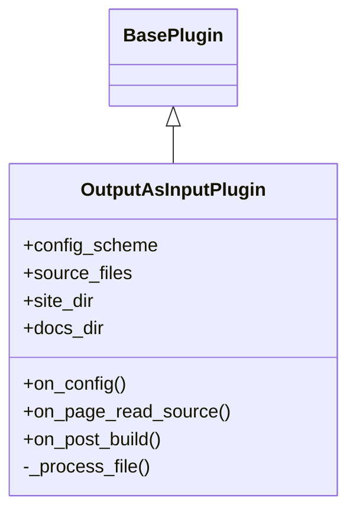

# API Reference

The MkDocs Output as Input plugin provides a clean API for developers who want to extend or integrate with the plugin.

## Overview

The plugin is implemented as a standard MkDocs plugin that hooks into the build process at two key points:

1. **`on_page_read_source`** - Captures source files and frontmatter
2. **`on_post_build`** - Processes HTML and creates cousin files

## Plugin Architecture



## Core Components

### OutputAsInputPlugin

::: mkdocs_output_as_input.plugin.OutputAsInputPlugin
    options:
      show_source: true
      show_bases: true
      show_root_heading: true
      show_root_full_path: false
      members_order: source

## Configuration Schema

The plugin uses MkDocs' configuration validation system:

```python
from mkdocs.config import config_options

config_scheme = (
    ("stage_dir", config_options.Type(str, default="stage")),
    ("html_element", config_options.Type((str, list), default="main")),
    ("target_tag", config_options.Type(str, default="article")),
    ("include_frontmatter", config_options.Type(bool, default=True)),
    ("preserve_links", config_options.Type(bool, default=False)),
    ("minify", config_options.Type(bool, default=False)),
    ("prettify", config_options.Type(bool, default=False)),
    ("verbose", config_options.Type(bool, default=False)),
)
```

## Plugin Hooks

### on_config

Called after the MkDocs configuration is loaded.

```python
def on_config(self, config: dict[str, Any]) -> dict[str, Any]:
    """Store site and docs directories and validate configuration."""
    self.site_dir = Path(config["site_dir"])
    self.docs_dir = Path(config["docs_dir"])
    
    # Validate mutually exclusive options
    if self.config["minify"] and self.config["prettify"]:
        raise ValueError("Cannot use both 'minify' and 'prettify'")
    
    return config
```

### on_page_read_source

Called when MkDocs reads a source file.

```python
def on_page_read_source(
    self, 
    page: Page, 
    config: dict[str, Any]
) -> Optional[str]:
    """Capture source Markdown content and frontmatter."""
    # Extract and store frontmatter
    # Return None to let MkDocs continue processing
```

### on_post_build

Called after the site is built.

```python
def on_post_build(self, config: dict[str, Any]) -> None:
    """Process all HTML files and create cousin Markdowns."""
    # Create stage directory
    # Process each tracked source file
    # Log statistics
```

## Extending the Plugin

### Custom Processor Example

Create a custom processor that extends the plugin:

```python
from mkdocs_output_as_input.plugin import OutputAsInputPlugin
from typing import Any
import re

class CustomOutputPlugin(OutputAsInputPlugin):
    """Extended plugin with custom processing."""
    
    def __init__(self) -> None:
        super().__init__()
        self.custom_replacements = {}
    
    def on_config(self, config: dict[str, Any]) -> dict[str, Any]:
        """Add custom configuration."""
        config = super().on_config(config)
        
        # Add custom processing rules
        if "custom_replacements" in self.config:
            self.custom_replacements = self.config["custom_replacements"]
        
        return config
    
    def _process_file(
        self, 
        src_path: str, 
        file_info: dict[str, Any], 
        stage_dir: Path
    ) -> None:
        """Process with custom replacements."""
        # Call parent processing
        super()._process_file(src_path, file_info, stage_dir)
        
        # Apply custom replacements
        cousin_path = stage_dir / src_path
        if cousin_path.exists():
            content = cousin_path.read_text()
            
            for old, new in self.custom_replacements.items():
                content = content.replace(old, new)
            
            cousin_path.write_text(content)
```

### Hook Integration Example

Integrate with other MkDocs plugins:

```python
class IntegratedOutputPlugin(OutputAsInputPlugin):
    """Plugin that integrates with other plugins."""
    
    def on_page_content(
        self, 
        html: str, 
        page: Page, 
        config: dict[str, Any], 
        files: Files
    ) -> str:
        """Hook into page content processing."""
        # Store additional metadata
        if page.file.src_path in self.source_files:
            self.source_files[page.file.src_path]["processed_html"] = html
        
        return html
```

## Utility Functions

### Frontmatter Extraction

```python
def extract_frontmatter(content: str) -> tuple[dict[str, Any], str]:
    """Extract YAML frontmatter from Markdown content.
    
    Args:
        content: Raw Markdown content
        
    Returns:
        Tuple of (frontmatter_dict, remaining_content)
    """
    if not content.startswith("---\n"):
        return {}, content
    
    try:
        end_idx = content.find("\n---\n", 4)
        if end_idx > 0:
            fm_text = content[4:end_idx]
            frontmatter = yaml.safe_load(fm_text) or {}
            remaining = content[end_idx + 5:]
            return frontmatter, remaining
    except yaml.YAMLError:
        pass
    
    return {}, content
```

### HTML Processing

```python
def process_html_content(
    html: str, 
    selector: str, 
    target_tag: str
) -> Optional[str]:
    """Extract and transform HTML content.
    
    Args:
        html: Full HTML document
        selector: CSS selector or tag name
        target_tag: Tag to use in output
        
    Returns:
        Transformed HTML or None if not found
    """
    soup = BeautifulSoup(html, "html.parser")
    
    # Try CSS selector first
    elements = soup.select(selector)
    if not elements:
        # Fall back to tag name
        element = soup.find(selector)
        if element:
            elements = [element]
    
    if not elements:
        return None
    
    # Transform and return
    if len(elements) == 1:
        elements[0].name = target_tag
        return str(elements[0])
    else:
        # Wrap multiple elements
        container = soup.new_tag(target_tag)
        for elem in elements:
            container.append(elem.extract())
        return str(container)
```

## Type Definitions

The plugin uses Python type hints for better IDE support:

```python
from typing import Any, Optional, Dict, List
from pathlib import Path

SourceFileInfo = Dict[str, Any]
SourceFilesMap = Dict[str, SourceFileInfo]
ConfigDict = Dict[str, Any]
```

## Error Handling

The plugin implements graceful error handling:

```python
class OutputAsInputError(Exception):
    """Base exception for plugin errors."""
    pass

class ConfigurationError(OutputAsInputError):
    """Raised for configuration issues."""
    pass

class ProcessingError(OutputAsInputError):
    """Raised during file processing."""
    pass
```

## Logging

The plugin uses Python's standard logging:

```python
import logging

logger = logging.getLogger(__name__)

# Usage in plugin
if self.config["verbose"]:
    logger.info(f"Processing {src_path}")
    logger.debug(f"Extracted elements: {len(elements)}")
```

## Testing the API

Example test for plugin functionality:

```python
import pytest
from mkdocs_output_as_input.plugin import OutputAsInputPlugin

def test_plugin_configuration():
    """Test plugin configuration."""
    plugin = OutputAsInputPlugin()
    
    # Test default configuration
    assert plugin.config["stage_dir"] == "stage"
    assert plugin.config["html_element"] == "main"
    
    # Test custom configuration
    plugin.config["stage_dir"] = "custom"
    assert plugin.config["stage_dir"] == "custom"

def test_frontmatter_extraction():
    """Test frontmatter extraction."""
    content = """---
title: Test
---

# Content
"""
    plugin = OutputAsInputPlugin()
    # Test extraction logic
```

## Integration Examples

### Programmatic Usage

```python
from mkdocs_output_as_input.plugin import OutputAsInputPlugin
from mkdocs.config import load_config

# Load MkDocs configuration
config = load_config("mkdocs.yml")

# Create and configure plugin
plugin = OutputAsInputPlugin()
plugin.config = {
    "stage_dir": "output",
    "verbose": True
}

# Use plugin methods directly
plugin.on_config(config)
```

### Custom Build Script

```python
#!/usr/bin/env python3
"""Custom build script using the plugin."""

import sys
from pathlib import Path
from mkdocs.commands.build import build
from mkdocs.config import load_config

def custom_build():
    """Build with custom processing."""
    # Load config
    config = load_config("mkdocs.yml")
    
    # Add our plugin programmatically
    config["plugins"]["output-as-input"] = {
        "stage_dir": "processed",
        "verbose": True
    }
    
    # Build
    build(config)
    
    # Post-process
    process_stage_files(Path("processed"))

def process_stage_files(stage_dir: Path):
    """Additional processing of stage files."""
    for file in stage_dir.rglob("*.md"):
        # Custom processing here
        pass

if __name__ == "__main__":
    custom_build()
```

## Performance Considerations

- The plugin stores all source file information in memory
- HTML parsing is done using BeautifulSoup with the default parser
- File I/O is synchronous (async support planned)
- Large sites may benefit from batch processing

## Future API Enhancements

Planned enhancements for future versions:

- Async file processing support
- Plugin extension hooks
- Custom processor registration
- Streaming API for large files
- Event system for progress tracking

## See Also

- [Configuration Reference](../configuration.md) - All configuration options
- [Examples](../examples.md) - Usage examples
- [Development Guide](../development.md) - Contributing to the plugin
- [Plugin Source Code](https://github.com/vexyart/vexy-mkdocs-output-as-input/blob/main/src/mkdocs_output_as_input/plugin.py)