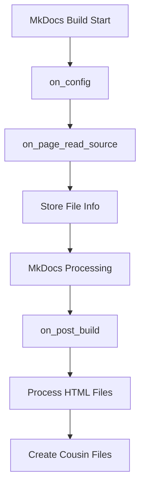

# Development Guide

This guide helps you set up a development environment and contribute to the MkDocs Output as Input plugin.

## Development Setup

### Prerequisites

- Python 3.8 or higher
- Git
- [uv](https://github.com/astral-sh/uv) (recommended) or pip
- Basic knowledge of Python and MkDocs

### Clone the Repository

```bash
# Clone the repository
git clone https://github.com/vexyart/vexy-mkdocs-output-as-input.git
cd vexy-mkdocs-output-as-input

# Create a new branch for your changes
git checkout -b feature/your-feature-name
```

### Set Up Development Environment

#### Using the Development Script (Recommended)

```bash
# Run the automated setup script
./scripts/dev-setup.sh
```

This script will:
- Create a virtual environment
- Install all dependencies
- Set up pre-commit hooks
- Run initial tests

#### Manual Setup

```bash
# Create virtual environment
python -m venv .venv
source .venv/bin/activate  # On Windows: .venv\Scripts\activate

# Install in development mode
pip install -e ".[dev,test,docs]"

# Install pre-commit hooks
pre-commit install
```

### Verify Installation

```bash
# Run tests
pytest

# Check code style
ruff check src tests

# Build documentation
mkdocs serve
```

## Project Structure

```
vexy-mkdocs-output-as-input/
├── src/
│   └── mkdocs_output_as_input/
│       ├── __init__.py         # Package initialization
│       ├── plugin.py           # Main plugin implementation
│       └── cli.py              # CLI interface
├── tests/
│   ├── test_plugin.py          # Plugin tests
│   └── test_cli.py             # CLI tests
├── src_docs/                   # Documentation source
├── docs/                       # Built documentation
├── scripts/                    # Development scripts
│   ├── dev-setup.sh           # Development setup
│   ├── test.sh                # Test runner
│   ├── build.sh               # Build script
│   └── release.sh             # Release script
├── pyproject.toml             # Project configuration
├── Makefile                   # Common tasks
└── .github/                   # GitHub configuration
    └── workflows/             # CI/CD workflows
```

## Development Workflow

### 1. Make Changes

Follow these coding standards:

#### Code Style

```python
# Use type hints
def process_file(self, path: Path, config: dict[str, Any]) -> None:
    """Process a single file.
    
    Args:
        path: Path to the file
        config: Configuration dictionary
    """
    
# Use descriptive names
html_element = config["html_element"]  # Good
he = config["html_element"]  # Bad

# Follow PEP 8
# Line length: 88 characters (Black default)
# Use meaningful docstrings
```

#### Logging

```python
# Use structured logging
logger.info(f"Processing {src_path}")
logger.debug(f"Found {len(elements)} elements")
logger.error(f"Failed to process {src_path}: {e}")

# Use appropriate levels
# DEBUG: Detailed diagnostic info
# INFO: General informational messages
# WARNING: Warning messages
# ERROR: Error messages
```

### 2. Write Tests

#### Test Structure

```python
class TestOutputAsInputPlugin:
    """Test cases for OutputAsInputPlugin."""
    
    @pytest.fixture
    def plugin(self):
        """Create a plugin instance."""
        return OutputAsInputPlugin()
    
    def test_feature(self, plugin):
        """Test specific feature."""
        # Arrange
        plugin.config["option"] = "value"
        
        # Act
        result = plugin.method()
        
        # Assert
        assert result == expected
```

#### Test Coverage

```bash
# Run tests with coverage
pytest --cov=mkdocs_output_as_input --cov-report=html

# View coverage report
open htmlcov/index.html
```

Aim for >90% test coverage.

### 3. Update Documentation

Update relevant documentation:

- API changes → `src_docs/api/index.md`
- New features → `src_docs/configuration.md` and `src_docs/examples.md`
- Bug fixes → `CHANGELOG.md`

### 4. Run Quality Checks

```bash
# Run all checks
make test

# Or run individually
pytest                           # Unit tests
ruff check src tests            # Linting
ruff format src tests           # Formatting
mypy src                        # Type checking
```

### 5. Commit Changes

Follow conventional commits:

```bash
# Format: <type>(<scope>): <subject>

git commit -m "feat(plugin): add new configuration option"
git commit -m "fix(parser): handle empty HTML elements"
git commit -m "docs(api): update process_file documentation"
git commit -m "test(plugin): add edge case tests"
```

Types:
- `feat`: New feature
- `fix`: Bug fix
- `docs`: Documentation
- `test`: Tests
- `refactor`: Code refactoring
- `style`: Formatting
- `chore`: Maintenance

## Testing

### Unit Tests

Located in `tests/test_plugin.py`:

```python
def test_new_feature(plugin, temp_dir):
    """Test your new feature."""
    # Create test files
    test_file = temp_dir / "test.md"
    test_file.write_text("# Test")
    
    # Test feature
    result = plugin.process(test_file)
    
    # Verify results
    assert result.exists()
```

### Integration Tests

Test with real MkDocs projects:

```python
def test_integration_with_material_theme(temp_dir):
    """Test with Material theme."""
    # Create mkdocs.yml
    config = {
        "site_name": "Test",
        "theme": {"name": "material"},
        "plugins": ["output-as-input"]
    }
    
    # Run build
    # Verify output
```

### Performance Tests

```python
def test_large_site_performance(benchmark):
    """Test performance with large sites."""
    plugin = OutputAsInputPlugin()
    
    # Create many files
    files = create_test_files(1000)
    
    # Benchmark processing
    result = benchmark(plugin.process_all, files)
    
    # Assert performance
    assert result.avg < 0.1  # 100ms average
```

## Code Architecture

### Plugin Flow



### Key Components

#### Plugin Class

```python
class OutputAsInputPlugin(BasePlugin):
    """Main plugin class."""
    
    config_scheme = (...)  # Configuration
    
    def on_config(self, config):
        """Initialize plugin."""
        
    def on_page_read_source(self, page, config):
        """Capture source files."""
        
    def on_post_build(self, config):
        """Process and create output."""
```

#### File Processing

```python
def _process_file(self, src_path, file_info, stage_dir):
    """Process individual file."""
    # 1. Find HTML output
    # 2. Parse HTML
    # 3. Extract elements
    # 4. Transform content
    # 5. Write cousin file
```

## Contributing Guidelines

### Pull Request Process

1. **Create feature branch**:
   ```bash
   git checkout -b feature/your-feature
   ```

2. **Make changes and test**:
   ```bash
   make test
   ```

3. **Update documentation**

4. **Create pull request**:
   - Clear description
   - Link related issues
   - Include test results

### Code Review Checklist

- [ ] Tests pass
- [ ] Coverage maintained/improved
- [ ] Documentation updated
- [ ] CHANGELOG.md updated
- [ ] No linting errors
- [ ] Type hints added

### Release Process

1. **Update version**:
   ```bash
   # In pyproject.toml
   version = "1.2.3"
   ```

2. **Update CHANGELOG.md**

3. **Create release**:
   ```bash
   ./scripts/release.sh patch  # or minor, major
   ```

## Advanced Development

### Debugging

#### Using VS Code

`.vscode/launch.json`:
```json
{
    "version": "0.2.0",
    "configurations": [
        {
            "name": "Debug Plugin",
            "type": "python",
            "request": "launch",
            "module": "mkdocs",
            "args": ["build", "-v"],
            "cwd": "${workspaceFolder}/test_project"
        }
    ]
}
```

#### Using pdb

```python
import pdb

def _process_file(self, ...):
    pdb.set_trace()  # Debugger breakpoint
    # Your code
```

### Profiling

```python
import cProfile
import pstats

def profile_plugin():
    """Profile plugin performance."""
    profiler = cProfile.Profile()
    profiler.enable()
    
    # Run plugin
    plugin.on_post_build(config)
    
    profiler.disable()
    stats = pstats.Stats(profiler)
    stats.sort_stats('cumulative')
    stats.print_stats(10)
```

### Memory Profiling

```python
from memory_profiler import profile

@profile
def process_large_site():
    """Monitor memory usage."""
    # Process files
```

## Continuous Integration

### GitHub Actions

The project uses GitHub Actions for CI/CD:

- **Tests**: Run on every push/PR
- **Coverage**: Upload to Codecov
- **Linting**: Check code style
- **Build**: Test package building
- **Release**: Automated PyPI publishing

### Local CI Simulation

```bash
# Run CI checks locally
act -j test

# Or use the Makefile
make ci
```

## Getting Help

### Developer Resources

- [MkDocs Plugin Guide](https://www.mkdocs.org/user-guide/plugins/)
- [Python Packaging Guide](https://packaging.python.org/)
- [GitHub Actions Docs](https://docs.github.com/en/actions)

### Communication

- **Issues**: Bug reports and feature requests
- **Discussions**: General questions and ideas
- **Pull Requests**: Code contributions

### Maintainer Notes

Current maintainers:
- @username (role)

Release schedule:
- Patch releases: As needed
- Minor releases: Monthly
- Major releases: Yearly or as needed