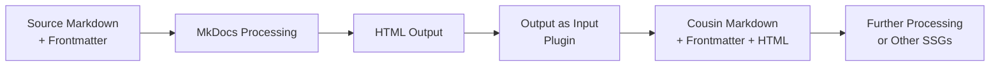

# MkDocs Output as Input Plugin

<div align="center">

[](https://pypi.org/project/vexy-mkdocs-output-as-input/)
[](https://github.com/vexyart/vexy-mkdocs-output-as-input/actions/workflows/ci.yml)
[](https://codecov.io/gh/vexyart/vexy-mkdocs-output-as-input)
[](https://opensource.org/licenses/MIT)
[](https://pypi.org/project/vexy-mkdocs-output-as-input/)

**Transform your MkDocs HTML output into reusable Markdown files with preserved metadata**

</div>

## 🚀 What is Output as Input?

The **MkDocs Output as Input** plugin captures the fully-rendered HTML output from MkDocs and creates "cousin" Markdown files that combine your original frontmatter with the processed HTML content. This enables powerful post-processing workflows and multi-stage documentation pipelines.

<div class="grid cards" markdown>

-   :material-lightning-bolt:{ .lg .middle } **Easy Integration**

    ---

    Add one line to your `mkdocs.yml` and start capturing output immediately. Works with any MkDocs theme.

    [:octicons-arrow-right-24: Getting Started](getting-started.md)

-   :material-puzzle:{ .lg .middle } **Flexible Processing**

    ---

    Extract specific HTML elements, preserve frontmatter, and customize output format to fit your workflow.

    [:octicons-arrow-right-24: Configuration](configuration.md)

-   :material-sync:{ .lg .middle } **Pipeline Ready**

    ---

    Perfect for multi-stage documentation pipelines, content reuse, and integration with other static site generators.

    [:octicons-arrow-right-24: Examples](examples.md)

-   :material-code-tags:{ .lg .middle } **Developer Friendly**

    ---

    Clean API, comprehensive tests, and extensive documentation for contributors and extenders.

    [:octicons-arrow-right-24: API Reference](api/index.md)

</div>

## ⚡ Quick Start

### Installation

=== "pip"

    ```bash
    pip install vexy-mkdocs-output-as-input
    ```

=== "uv"

    ```bash
    uv pip install vexy-mkdocs-output-as-input
    ```

=== "From Source"

    ```bash
    git clone https://github.com/vexyart/vexy-mkdocs-output-as-input
    cd vexy-mkdocs-output-as-input
    pip install -e .
    ```

### Basic Usage

Add to your `mkdocs.yml`:

```yaml
plugins:
  - search  # Other plugins
  - output-as-input
```

Build your site:

```bash
mkdocs build
```

Find your processed files in the `stage/` directory! 🎉

## 📋 How It Works



1. **Input**: Your source Markdown files with YAML frontmatter
2. **Processing**: MkDocs renders your content with themes and plugins
3. **Capture**: Output as Input extracts the rendered HTML
4. **Output**: New Markdown files with original metadata + processed content

## 🎯 Key Features

### ✅ Preserve Original Metadata
Your YAML frontmatter travels with your content through the entire pipeline.

### ✅ Flexible HTML Extraction
Target specific elements using tags, classes, or CSS selectors.

### ✅ Theme Agnostic
Works with Material, ReadTheDocs, or any MkDocs theme.

### ✅ Pipeline Integration
Perfect for Hugo, Jekyll, Eleventy, or custom workflows.

### ✅ Performance Optimized
Handles large documentation sites efficiently with parallel processing.

### ✅ Extensive Configuration
Fine-tune every aspect of the extraction and output process.

## 🛠️ Common Use Cases

<div class="grid cards" markdown>

-   **Multi-Stage Pipelines**
    
    Process with MkDocs first, then feed to Hugo or Jekyll for final publication.

-   **Content Extraction**
    
    Extract just the article content without theme navigation and UI elements.

-   **Documentation Reuse**
    
    Share processed content across multiple documentation sites.

-   **Custom Templates**
    
    Apply your own templates to MkDocs-processed content.

</div>

## 📚 Learn More

- [**Getting Started Guide**](getting-started.md) - Installation and first steps
- [**Configuration Reference**](configuration.md) - All options explained
- [**Examples & Tutorials**](examples.md) - Real-world usage patterns
- [**API Documentation**](api/index.md) - For developers and contributors
- [**FAQ**](faq.md) - Frequently asked questions
- [**Troubleshooting**](troubleshooting.md) - Common issues and solutions

## 🤝 Contributing

We welcome contributions! Check out our [Development Guide](development.md) to get started.

## 📄 License

This project is licensed under the MIT License - see the [LICENSE](https://github.com/vexyart/vexy-mkdocs-output-as-input/blob/main/LICENSE) file for details.

## 💬 Support

- 🐛 [Report Issues](https://github.com/vexyart/vexy-mkdocs-output-as-input/issues)
- 💡 [Discussions](https://github.com/vexyart/vexy-mkdocs-output-as-input/discussions)
- 📧 [Email Support](mailto:support@example.com)